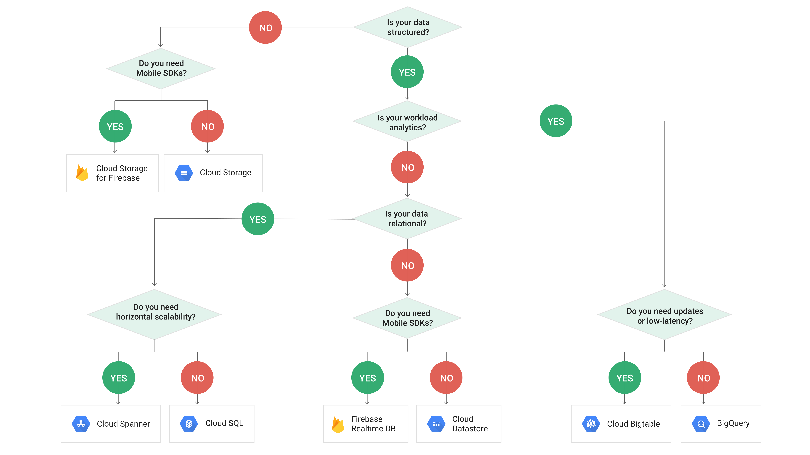
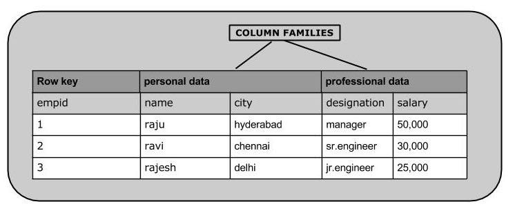

# Google-PDE-Exam


#  BBS TALKS


https://acloud.guru/forums/gcp-certified-professional-data-engineer/


##  GCP Solutions
https://gcp.solutions/


##  storage option




## bigtable

###  bigtable

https://cloud.google.com/bigtable/docs/cbt-reference?hl=zh-cn


**Hbase**




环境搭建：https://github.com/big-data-europe/docker-hbase

```
docker-compose -f docker-compose-standalone.yml up -d
```

portainer:

```
进入standalone docker内部
```

打开hbase shell

```
hbase shell
```


###  基础教程：
https://www.yiibai.com/hbase/


